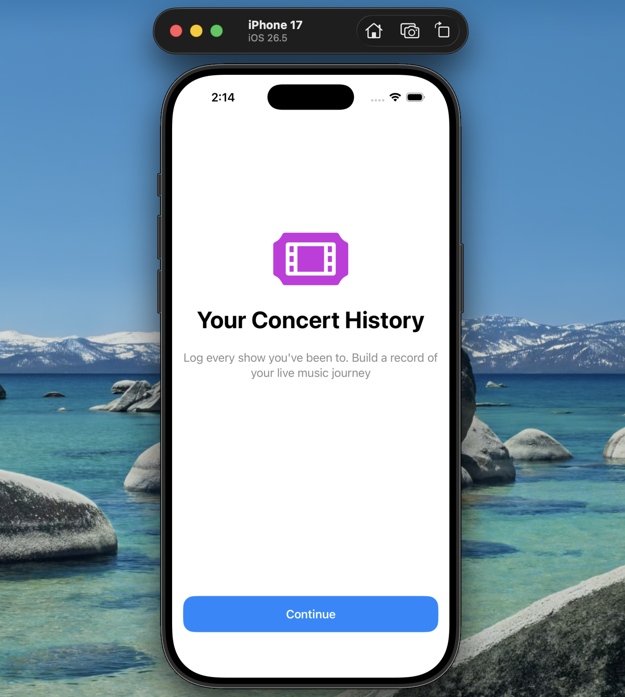
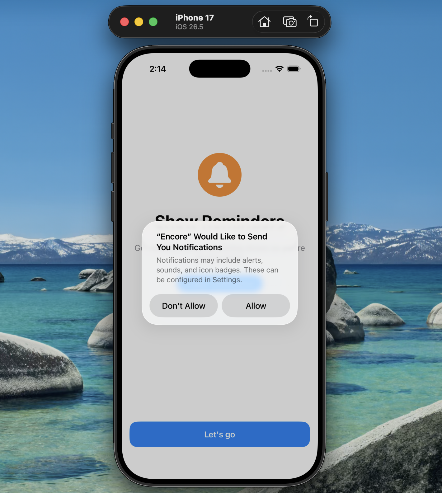
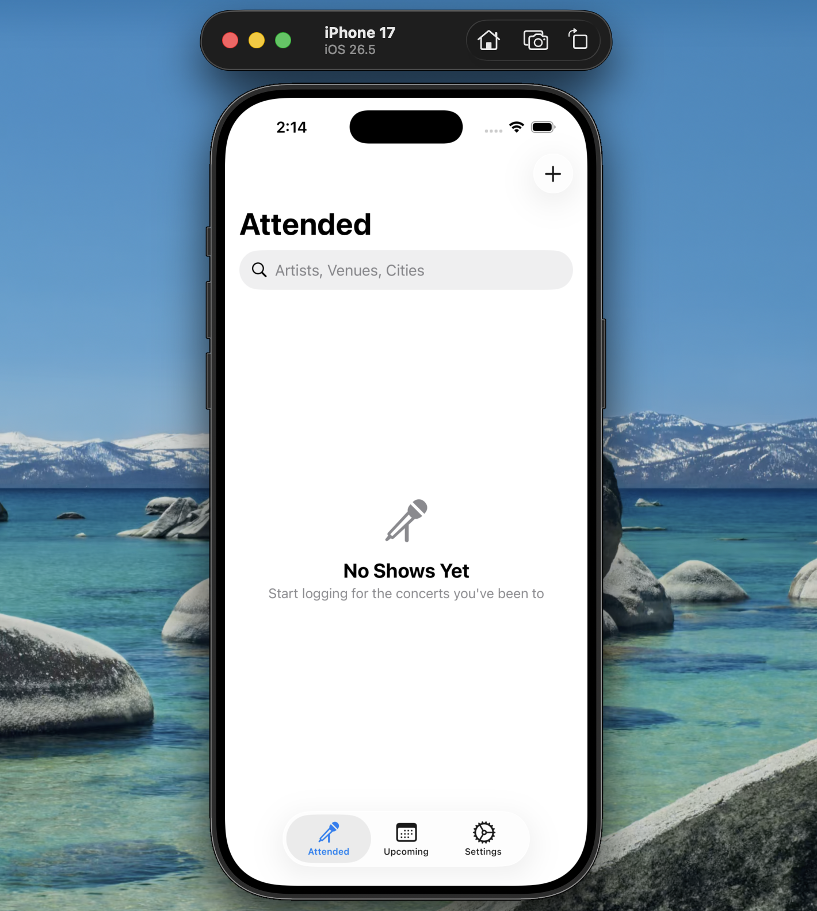
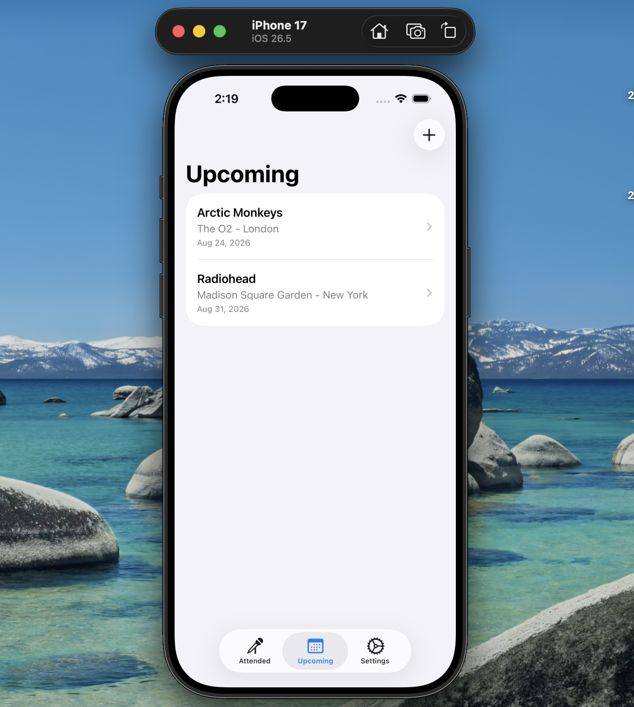
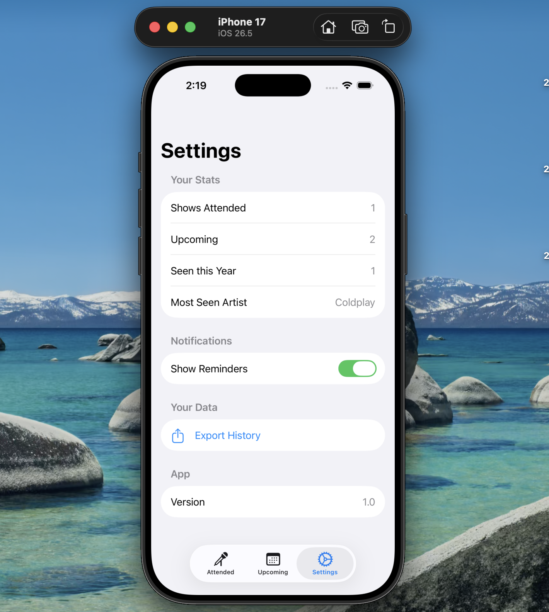

# 🎵 Encore

### Your personal concert history, all in one place.

Encore is a modern iOS concert tracker built with **SwiftUI, SwiftData and MVVM**. It lets you keep track of the concerts you've attended, save upcoming shows, capture ratings, notes and setlists and revisit your live music history anytime.

[](https://www.swift.org/)
[](https://developer.apple.com/xcode/swiftui/)
[](https://developer.apple.com/xcode/swiftdata/)
[](https://developer.apple.com/ios/)

> **Encore** is designed to turn a collection of concert memories into a personal, searchable history of live music experiences.

---
## 📖 About

Encore is a personal concert tracking app designed for people who want to keep a record of their live music experiences.

The app separates concerts into two main categories:

- 🎤 **Attended** — Keep track of shows you've already experienced.
- 📅 **Upcoming** — Save concerts you plan to attend.

Each concert can contain details such as the artist, venue, city, date, status, rating, notes and setlist.

Encore also provides a guided onboarding experience, notification permission handling, searchable concert history, editable show details, setlist management, concert statistics and the ability to export your attended concert history through the native iOS share sheet.

The project was built with a focus on **clean architecture, reusable SwiftUI components, reactive data flow and native iOS frameworks**.

### 🎯 Project Goals

Encore was built to explore and demonstrate:

- Building a complete iOS application with **SwiftUI**
- Implementing **MVVM architecture**
- Persisting structured data with **SwiftData**
- Managing state using modern SwiftUI property wrappers
- Building reusable and composable UI components
- Implementing navigation and sheet-based workflows
- Working with system APIs such as **UserNotifications**
- Creating a polished, state-driven user experience

## ✨ Features

### 🎤 Concert Management

- Add new concerts with artist, venue, city, date and status.
- Edit existing concert information.
- Delete concerts with confirmation.
- Automatically separate shows into **Attended** and **Upcoming**.
- Mark upcoming concerts as attended.
- Sort attended shows by date.
- Sort upcoming shows chronologically.

### 🔎 Search & Filtering

- Search attended concerts by:
  - Artist
  - Venue
  - City
- Case-insensitive search for a smoother user experience.
- Context-aware empty states for both empty history and unsuccessful searches.

### ⭐ Ratings & Notes

- Rate attended concerts using a reusable 5-star rating component.
- Add optional notes to individual concerts.
- Update ratings directly from the concert details screen.

### 🎵 Setlist Management

- Add songs to a concert's setlist.
- Delete songs from a setlist.
- Reorder songs using drag-and-drop.
- Display setlist entries with numbered positions.

### 📅 Upcoming Shows

- Maintain a dedicated list of concerts you plan to attend.
- Quickly mark a show as attended using swipe actions.
- Optionally add a rating when marking a show as attended.

### 🔔 Notifications

- Request notification permission during onboarding.
- View and manage notification status from Settings.
- Sync the UI with the current iOS notification authorization status.

### 📊 Concert Statistics

The Settings screen provides:

- Total shows attended
- Total upcoming shows
- Shows attended this year
- Most frequently seen artist

### 📤 Data Export

- Export attended concert history using the native iOS `ShareLink`.
- Generate a clean text-based concert history sorted by date.

### 👋 Onboarding

- Multi-page onboarding experience for first-time users.
- Introduces the core features of Encore.
- Notification permission request integrated into onboarding.
- Onboarding completion persisted using `@AppStorage`.

### 🧭 Navigation

- Three main tabs:
  - Attended
  - Upcoming
  - Settings
- Independent `NavigationStack` for each tab.
- Navigation from concert lists to detailed concert information.
- Sheet-based workflows for adding and editing shows.

### 🎨 Reusable UI Components

Encore uses reusable SwiftUI components including:

- `ShowRowView`
- `StarRatingView`
- `EmptyStateView`
- `OnboardingPageView`
- `OnboardingNotificationsPage`
- `MarkAttendedSheet`

## 📸 Screenshots

### Onboarding & First Launch

<table>
<tr>
<td align="center">
<br/>
<b>Onboarding</b>
</td>
<td align="center">
<br/>
<b>Notifications</b>
</td>
<td align="center">
<br/>
<b>Attended</b>
</td>
</tr>
</table>

### Concert Management

<table>
<tr>
<td align="center">
<br/>
<b>Add Show</b>
</td>
<td align="center">
<br/>
<b>Show Details</b>
</td>
<td align="center">
<br/>
<b>Upcoming</b>
</td>
</tr>
</table>

### Settings & Attendance

<table>
<tr>
<td align="center">
<br/>
<b>Settings</b>
</td>
<td align="center">
<br/>
<b>Mark Attended</b>
</td>
</tr>
</table>

## 🛠️ Tech Stack

| Technology | Purpose |
|------------|---------|
| **Swift** | Primary programming language |
| **SwiftUI** | Declarative UI framework for building the application interface |
| **SwiftData** | Local persistence and reactive data management |
| **MVVM** | Architecture for separating UI, state and business logic |
| **Observation Framework** | Reactive state management using `@Observable` |
| **UserNotifications** | Requesting and managing notification permissions |
| **AppStorage** | Persisting lightweight app preferences such as onboarding completion |
| **NavigationStack** | Type-safe navigation between screens |
| **ShareLink** | Native iOS sharing and concert-history export |
| **Xcode** | Development environment and project management |

## 🏗️ Architecture

Encore follows the **MVVM (Model–View–ViewModel)** architecture.

```text
┌─────────────────────┐
│        Views        │
│      SwiftUI UI     │
└──────────┬──────────┘
           │
           ▼
┌─────────────────────┐
│     ViewModels      │
│ State & screen logic│
└──────────┬──────────┘
           │
           ▼
┌─────────────────────┐
│        Model        │
│ Show + SwiftData    │
└─────────────────────┘
```

## 📂 Project Structure

```text
Encore/
├── Models/
│   └── Show.swift
│
├── ViewModels/
│   ├── AttendedViewModel.swift
│   ├── UpcomingViewModel.swift
│   ├── AddEditShowViewModel.swift
│   └── SettingsViewModel.swift
│
├── Views/
│   ├── AttendedView.swift
│   ├── UpcomingView.swift
│   ├── ShowDetailView.swift
│   ├── AddEditShowView.swift
│   ├── SettingsView.swift
│   ├── MainTabView.swift
│   └── Reusable Components
│
├── Resources/
│   └── Assets.xcassets
│
├── Screenshots/
│   ├── Onboarding.png
│   ├── Notifications.png
│   ├── Attended.png
│   ├── Add Show.png
│   ├── Show Details.png
│   ├── Upcoming.png
│   ├── Settings.png
│   └── Mark Attended.png
│
├── EncoreApp.swift
├── Info.plist
└── Encore.xcodeproj
```

## 💾 Data Persistence

Encore uses **SwiftData** for local persistence, allowing concert information to remain available between app launches.

The `Show` model is marked with `@Model` and stores all information associated with a concert, including its artist, venue, date, status, rating, notes and setlist.

```text
┌─────────────────┐
│   SwiftData     │
│   ModelContainer│
└────────┬────────┘
         │
         ▼
┌─────────────────┐
│   ModelContext  │
│ Insert / Delete │
│     / Update    │
└────────┬────────┘
         │
         ▼
┌─────────────────┐
│      @Query     │
│ Fetch & Observe  │
│      Shows      │
└────────┬────────┘
         │
         ▼
┌─────────────────┐
│   SwiftUI View  │
│  Reactive UI    │
└─────────────────┘
```
## 🚀 Getting Started

### Requirements

- macOS with **Xcode** installed
- iOS Simulator or a physical iOS device
- Xcode version compatible with the Swift and SwiftUI versions used by the project

### Installation

1. Clone the repository:

```bash
git clone https://github.com/Vallen328/Encore-Concert-Tracker.git
```
2. Navigate to the project:

```bash
cd Encore-Concert-Tracker
```
3. Open the Xcode project:

```bash
Encore.xcodeproj
```
4. Select an iOS Simulator or a connected iPhone.
5. Build and run the application using Xcode.

## 🧠 Key Technical Highlights

- **Modern SwiftUI state management** using `@State`, `@Binding`, `@Bindable`, `@Environment`, `@Query` and `@AppStorage`.
- **MVVM architecture** with dedicated ViewModels for screen-level state and logic.
- **SwiftData persistence** with reactive queries and `ModelContext`-based CRUD operations.
- **Type-safe navigation** using `NavigationStack` and `navigationDestination`.
- **Reusable SwiftUI components** for show rows, ratings, empty states and onboarding pages.
- **Form validation** for creating and editing concert records.
- **Native iOS APIs** including `UserNotifications` and `ShareLink`.
- **Reactive UI updates** where changes to persisted concert data are automatically reflected in the relevant views.
- **Reusable and maintainable code structure** separating models, ViewModels, views and resources.

## 🔮 Future Improvements

Potential improvements for future versions of Encore include:

- ☁️ **CloudKit synchronization** — Sync concert history across the user's Apple devices.
- 🔔 **Automatic show reminders** — Schedule local notifications before upcoming concerts.
- 🎫 **Ticket & poster attachments** — Store ticket information, concert posters or photos with each show.
- 📍 **Venue integration** — Add maps and location information for concert venues.
- 🔎 **Advanced filtering** — Filter concerts by artist, city, venue, year or rating.
- 📊 **Enhanced statistics** — Add charts for artists, venues, cities and yearly concert activity.
- 🎵 **Setlist sharing** — Share individual concert details and setlists.

## 👨‍💻 Author

**Vallen Dsouza**

Computer Engineering graduate and software developer interested in **iOS development, software engineering and building practical applications**.

- GitHub: [@Vallen328](https://github.com/Vallen328)

---

⭐ If you found Encore interesting, consider giving the repository a star!

Built with ❤️ using **SwiftUI** and **SwiftData**.
